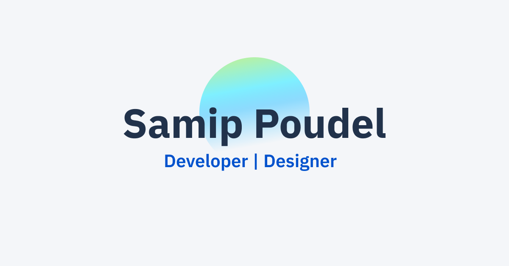

<a href="https://samippoudel.com.np/">
    
  </a>

  <h2 align="center">Samip Poudel's Portfolio Website</h2>

  <p align="center">Portfolio website with built-in blog</p>

  <p align="center">
    <a href="https://samippoudel.com.np">View Demo</a>
    ·
    <a href="https://github.com/SamipPoudel58/portfolio/issues">Report Bug</a>
    ·
    <a href="https://github.com/SamipPoudel58/portfolio/issues">Request Feature</a>
  </p>

## ⚙️ Tech Stack

- Gatsby.js (React)
- Sass
- Contentful
- Netlify (Hosting)

## 🚀 Local Development

Run the project in your machine locally.

### Step 1: Clone the repository

Clone the repo locally using:

```sh
git clone https://github.com/SamipPoudel58/portfolio.git
```

### Step 2: Install Dependencies

Install dependencies in the root folder

```sh
cd portfolio
npm install
```

### Step 3: Setup Environment Variables

You will need to provide your own `.env` variables, here's how you can do it:

- create a new file `.env` in the root
- open [.env.EXAMPLE](./.env.EXAMPLE)
- copy the contents and paste it into your own `.env` file
- make sure you replace the values with your own valid values

### Step 4: Run the server

```sh
npm run dev
```

## 🙏 Contributing

I'd love if you'd contribute to the project.

After cloning & setting up the local project you can push the changes to your github fork and make a pull request.

### Pushing the changes

```bash
git add .
git commit -m "feat: added new stuff"
git push YOUR_REPO_URL BRANCH_NAME
```

## 💡 Troubleshooting

If you run into errors, try checking out fixes for some frequently occuring errors in the [Troubleshooting Guide](./TROUBLESHOOT.md)
